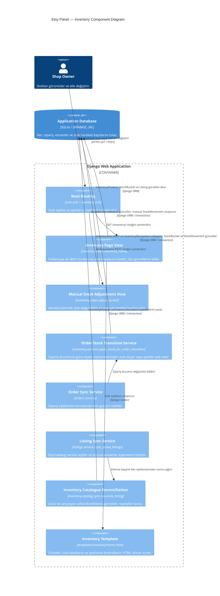

# Etsy Panel C4 Component Diagram — Inventory

Bu diyagram, [container diyagramındaki](c4-container.md) `Django Web Application` container'ının yalnızca stok yönetimiyle ilgili bileşenlerini gösterir. `Inventory` bağımsız bir container değildir; Django uygulaması içindeki bir işlev alanıdır. Yönlendirme ve sipariş eşitleme, bu alanla etkileşen aynı container içindeki bileşenlerdir.

## Akış

1. Kullanıcı `GET /inventory/` isteği gönderdiğinde `inventory_home`, o kullanıcıya ait aktif `InventoryProduct` ve `StockBucket` kayıtlarını okur. İlgili yerel `Listing` görsellerini ekleyip `inventory/home.html` sayfasını oluşturur.
2. Kullanıcı `POST /inventory/adjust/<bucket_id>/` ile `+1` veya `-1` gönderdiğinde `adjust_bucket`, kullanıcının aktif stok kovasını bulur. Geçerli değişiklikte miktarı günceller ve aynı işlem içinde `manual` nedenli bir `StockMovement` oluşturur. İstek türüne göre JSON yanıtı verir veya stok sayfasına yönlendirir.
3. `orders.services` sipariş eşitlemesi sonrasında `apply_stock_for_order_transition` hizmetini çağırır. Sipariş `shipped` durumuna yeni geçtiğinde hizmet, sipariş kalemini aktif envanter varyasyonuyla ve reçete satırlarıyla eşleştirir; ilgili kovalardan stok düşüp `ship_deduct` hareketlerini kaydeder. Sipariş yeni iptal edildiğinde önceden düşülmüş miktarı `cancel_restock` hareketleriyle geri ekler.
4. İlan eşitlemesi başarılı olduğunda ve `INVENTORY_CATALOG_SYNC_ENABLED=1` ise katalog eşleştirme hizmeti envanter adlarını ve Etsy kimliklerini günceller. Yeni varyasyonlar reçetesiz oluşturulur ve envanter sayfasında eşleme beklediği gösterilir; kovalar ve reçeteler otomatik oluşturulmaz.

Manuel stok ayarı doğrudan view içinde yapılır; otomatik sipariş geçişleri `inventory.services` içindedir. Sipariş kalemi için uygun varyasyon veya reçete bulunmazsa otomatik stok düşümü yapılmaz.
