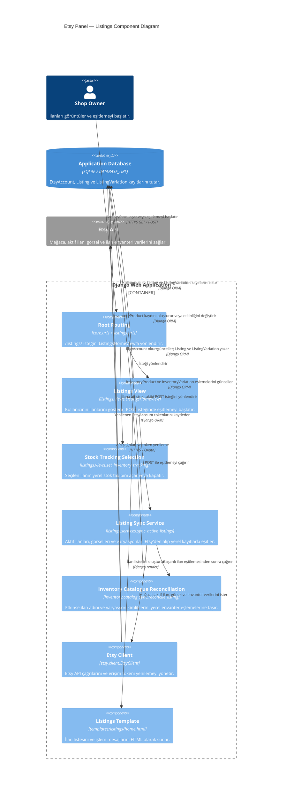

# Etsy Panel C4 Component Diagram — Listings

Bu diyagram, [container diyagramındaki](c4-container.md) `Django Web Application` container'ının yalnızca ilan yönetimiyle ilgili bileşenlerini gösterir. `Listings` bağımsız bir container değildir; Django uygulaması içindeki bir işlev alanıdır. Diyagramdaki yönlendirme ve Etsy istemcisi aynı container'ın, ilan akışında kullanılan ortak bileşenleridir.

## Akış

1. Kullanıcı `GET /listings/` isteği gönderdiğinde `ListingsHomeView`, yalnızca o kullanıcıya ait yerel ilanları ve görünür varyasyonları okuyup `listings/home.html` ile gösterir.
2. Kullanıcı aynı adrese `POST` isteği gönderdiğinde view, `sync_active_listings` hizmetini çağırır. Hizmet, gerekirse mağaza kimliğini bulur; aktif ilanları sayfalar halinde, görselleri ve envanteri toplu olarak Etsy istemcisi üzerinden çeker.
3. Hizmet `Listing` ve `ListingVariation` kayıtlarını günceller veya oluşturur. Varyasyon eşitleme hatalarını ilan bazında kaydedip diğer ilanlarla devam eder; sonucu view'a döndürür. View kullanıcıya işlem mesajı göstererek ilan sayfasına yönlendirir.
4. Kullanıcı bir ilanda stok takibini başlattığında `InventoryProduct` oluşturulur veya yeniden etkinleştirilir. Takip durdurulduğunda kayıt pasif olur; stok kovaları, reçeteler ve hareket geçmişi korunur.
5. `INVENTORY_CATALOG_SYNC_ENABLED=1` olduğunda aynı Etsy verisiyle yalnızca stok takibi açık ürünlerin ve varyasyonların adları/kimlikleri eşitlenir. Stok kovaları, reçeteler ve stok hareketleri değiştirilmez. Eksik Etsy envanter yanıtı mevcut varyasyonları silmez.

Bu eşitleme, Etsy'de artık aktif olmayan ilanları yerel veritabanından silmez ve Etsy tarafındaki stok miktarını değiştirmez.
