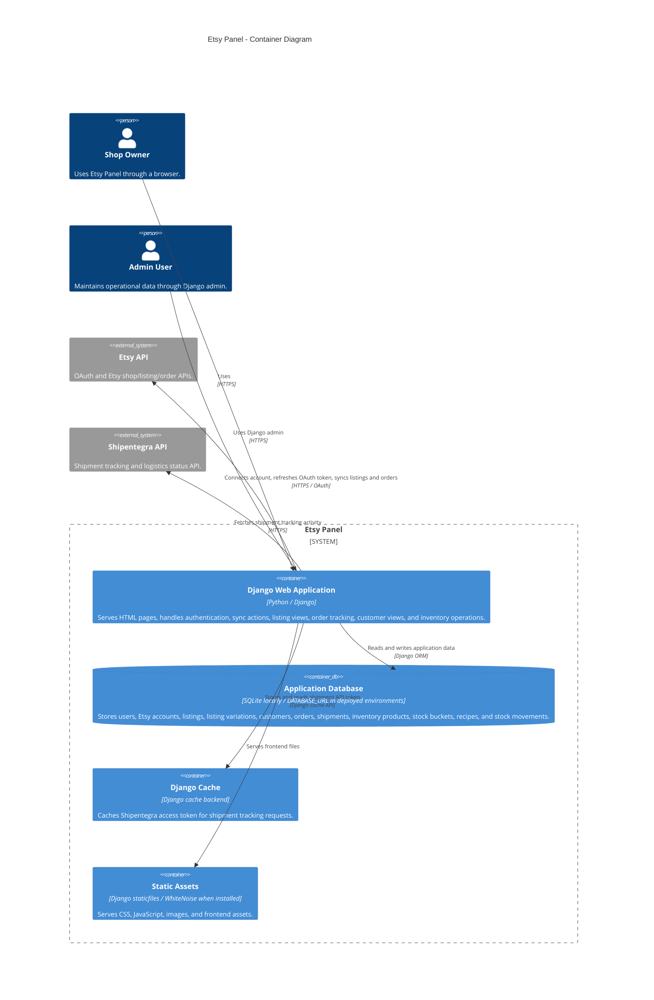
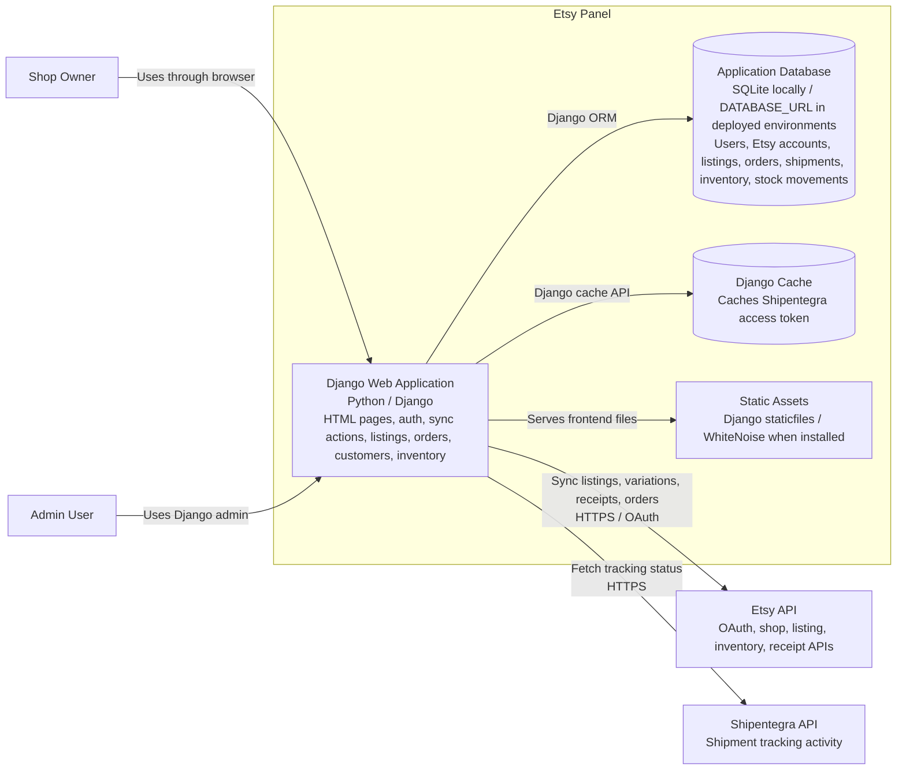

# Etsy Panel C4 Container Diagram

## Purpose

This document shows the main deployable/runtime containers inside the Etsy Panel system boundary and the external systems they communicate with.

## Container Diagram

## Container Diagram Flowchart

This version is easier to render in standard Mermaid preview tools.

## Web Application Responsibilities

The Django web application contains these application modules:

- `accounts`: User account and authentication-related app structure.
- `etsy`: Etsy OAuth connection, token handling, and API client.
- `listings`: Active listing sync, listing image sync, and listing variation sync.
- `orders`: Receipt sync, order item sync, shipment tracking, and order status management.
- `customers`: Buyer/customer views and customer records.
- `inventory`: Inventory products, stock buckets, variation recipes, stock movements, and manual stock adjustment.
- `core`: Project settings, root URLs, dashboard, WSGI, and ASGI entrypoints.

## Database Responsibilities

The application database stores the persistent business state:

- Auth users and sessions.
- Connected Etsy account credentials and shop identifiers.
- Synced listings and listing variations.
- Buyers and customer data.
- Orders, order items, and shipments.
- Inventory products, stock buckets, variation recipes, and stock movements.

## Important Boundaries

- Etsy Panel owns the local operational state. Etsy remains the source for listing and receipt data.
- Inventory mapping is local business data. The current order sync flow does not automatically create missing inventory products.
- Shipment tracking status comes from Shipentegra, but order and shipment records are stored locally.
- Stock deduction is performed inside the Django web application and persisted through `StockBucket` and `StockMovement`.
