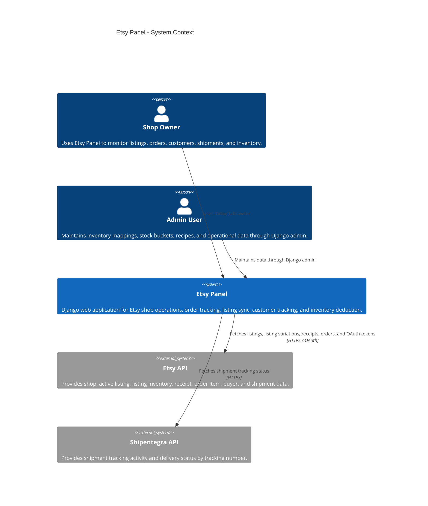
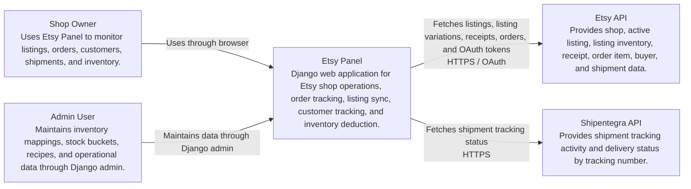

# Etsy Panel C4 Context Diagram

## Purpose

This document shows the system context for Etsy Panel. It explains who uses the system and which external systems Etsy Panel depends on.

## System Context

## System Context Flowchart

This version is easier to render in standard Mermaid preview tools.

## Main Responsibilities

Etsy Panel is responsible for:

- Connecting a user account to Etsy.
- Syncing active Etsy listings and listing variations.
- Syncing Etsy receipts into local orders and order items.
- Tracking buyers and shipment information.
- Matching order items to inventory products and variations.
- Deducting stock from inventory buckets when shipped orders qualify.
- Recording stock changes in stock movement history.

## External Systems

### Etsy API

Used by:

- `etsy.client.EtsyClient`
- `listings.services.sync_active_listings`
- `orders.services.sync_orders`

Data fetched:

- User shops
- Active listings
- Listing images
- Listing inventory and variation data
- Shop receipts and order transactions
- OAuth access and refresh tokens

### Shipentegra API

Used by:

- `orders.shipentegra.ShipentegraClient`
- `orders.services.fetch_ship_status`

Data fetched:

- Shipment activity
- Carrier status
- Delivery status
- Delivery date or last activity date

## Important Notes

- Inventory product records are local application data, not automatically created by the current Etsy order sync flow.
- Stock deduction depends on inventory mapping being complete: product, variation, recipe, and stock bucket must exist.
- Stock movement records are the audit trail for automatic and manual inventory changes.
